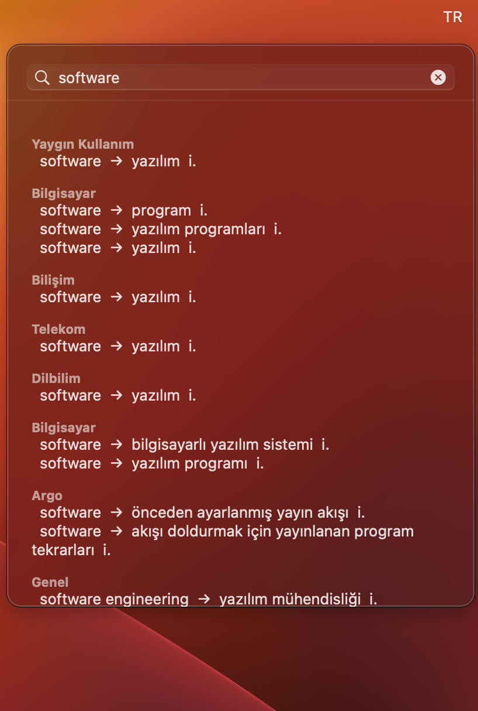

# Tureng

> Menu-bar Turkish ↔ English translator for macOS. Click the icon, type a word, get tureng.com results — without leaving what you're doing.



## What is this?

[tureng.com](https://tureng.com) is the de-facto Turkish ↔ English dictionary — it groups results by domain (everyday speech, idioms, finance, medicine, etc.) and is what most Turkish speakers reach for online. **Tureng** is a small native macOS app that wraps it. Instead of opening a browser tab and waiting for the page, you tap the `TR` icon in your menu bar, type a word, hit `Enter`, and click any translation to copy it. The panel disappears when you click away.

## Features

- **Lives in the menu bar** — no Dock icon, no window clutter
- **Click a translation to copy it** — a small "Copied" pill confirms
- **Hold `⇧ Shift` to peek through** the panel — see what's underneath without dismissing
- **`Esc` to dismiss, `⌘Q` to quit** — fully keyboard-driven
- **Right-click the `TR` icon** for a quit menu, if you prefer the mouse

## Install

### Option A — Download the prebuilt app

1. Grab `Tureng.app.zip` from the [latest release](https://github.com/y4hyya/Turengapp/releases/latest)
2. Unzip, drag `Tureng.app` to `/Applications`
3. **First launch:** macOS Gatekeeper will block it because the app isn't signed. Right-click `Tureng.app` → **Open** → confirm. You only need to do this once.
4. Click the `TR` icon in your menu bar.

> **Requires:** macOS 13 or newer, Apple Silicon (M1 / M2 / M3 / …). For Intel, build from source with `arch = "x86_64"` in `setup.py`.

### Option B — Build from source

```bash
git clone https://github.com/y4hyya/Turengapp.git
cd Turengapp
pip3 install -r requirements.txt py2app
python3 setup.py py2app
mv dist/Tureng.app /Applications/
```

Same Gatekeeper note applies on first launch.

## Launch at login

So the `TR` icon is there every time you start your Mac:

1. Open **System Settings** → **General** → **Login Items & Extensions**
2. Under **Open at Login**, click `+`
3. Pick **Tureng** from `/Applications` and click **Open**

## Usage

| Action | Result |
|---|---|
| Click `TR` | Open / close the popover |
| Type a word + `↩` | Search tureng.com |
| Click a translation row | Copy that word to the clipboard |
| Hold `⇧ Shift` | Fade the panel to peek at what's behind it |
| `Esc` | Dismiss the popover |
| `⌘Q` | Quit |
| Right-click `TR` → Quit Tureng | Quit |

## How it works

Two Python files, one process:

- **`app.py`** — Menu-bar UI built directly on AppKit through PyObjC. A borderless `NSPanel` anchored under the status item, with a frosted-glass `NSVisualEffectView` background, an `NSSearchField`, and a click-to-copy results view.
- **`scraper.py`** — Hits `tureng.com/tr/turkce-ingilizce/<word>` with [cloudscraper](https://github.com/VeNoMouS/cloudscraper) (tureng sits behind Cloudflare) and parses the result tables with BeautifulSoup.

Network work happens on a background thread; UI updates marshal back to the main thread via `performSelectorOnMainThread_`. If you want the full architecture rundown — PyObjC bridge conventions, threading rules, peek animation internals — see [`CLAUDE.md`](CLAUDE.md).

## Develop

For fast iteration, run from source — no rebuild needed:

```bash
python3 app.py
```

`Ctrl+C` in the terminal quits cleanly. When you're ready to ship a new version of `Tureng.app`:

```bash
python3 setup.py py2app
mv -f dist/Tureng.app /Applications/
```

To package a build for a GitHub Release:

```bash
ditto -c -k --sequesterRsrc --keepParent /Applications/Tureng.app Tureng.app.zip
```

Then create a new Release on GitHub and upload `Tureng.app.zip` as the asset.

## Caveats

- **Scrapes tureng.com.** There is no public API. If tureng changes their HTML, this app will need updating.
- **Cloudflare.** Uses `cloudscraper` to pass tureng's bot challenge. If that library falls behind a Cloudflare update, the app stops returning results until the dependency is upgraded.
- **Apple Silicon only as built.** Change `arch` in `setup.py` for Intel or universal builds.
- **Unsigned bundle.** Gatekeeper warns on first launch. Right-click → Open the first time. Proper signing requires a $99/year Apple Developer Program — not worth it for a personal utility.
- **Not affiliated with tureng.com.** Please be a good citizen — don't hammer the site.

## Credits

Built by [@y4hyya](https://github.com/y4hyya). Translation data from [tureng.com](https://tureng.com).
